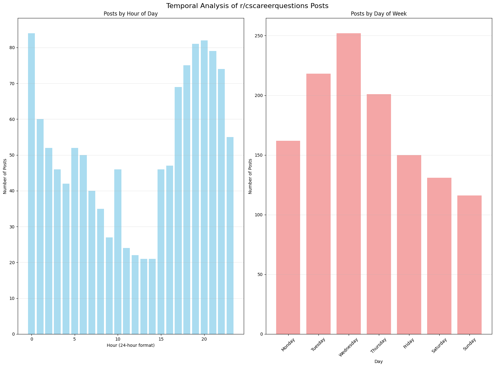

# r/cscareerquestions Exploratory Data Analysis (EDA)

This project presents an **Exploratory Data Analysis (EDA)** of posts from the subreddit **r/cscareerquestions** between **2024-09-26 and 2025-09-25**. The analysis explores posting patterns, engagement metrics, sentiment, text statistics, and career-related themes to better understand community trends and behaviors.

---

## Dataset Overview

* **Total posts analyzed:** 1,230
* **Unique authors:** 996
* **Date range:** 2024-09-26 to 2025-09-25
* **Self posts:** 100% (So no link posts)
* **Missing values:** None in title or text

---

## Activity & Temporal Patterns

* **Peak posting hour:** 00:00 UTC 
* **Most active day:** Wednesday

---

## Engagement Metrics

* **Average score:** 340.0 (Score = Upvotes - Downvotes)
* **Median score:** 5.0
* **Average comments per post:** 90.4
* **Average upvote ratio:** 0.730
* **Flairs matter** Meta, Lead Manger and Experinced posts have more score than new grads and students.
* **Correlation:**

  * Score ↔ Comments: **0.853** (strong)
  * Score ↔ Upvote ratio: **0.326** (moderate)

---

## Author Activity

Top contributors by number of posts:

* CSCQMods: 27
* [[deleted]]: 15
* cs-grad-person-man: 13
* metalreflectslime: 12
* oppalissa: 9
* Particular_World_934: 7
* MarathonMarathon: 7
* Legitimate-mostlet: 6
* ContainerDesk: 6
* Ok-Cartographer-5544: 6

---

## Flair Distribution

Most common post flairs:

* **Experienced:** 213 posts (17.3%) 
* **Student:** 133 posts (10.8%)
* **New Grad:** 118 posts (9.6%)
* **Meta:** 21 posts (1.7%)
* **Lead/Manager:** 9 posts (0.7%)

---

## Text Statistics

* **Average title length:** 59.8 characters
* **Median title length:** 54 characters
* **Average text length:** 951 characters
* **Median text length:** 738 characters
* **Unique words:**

  * Titles: 2,361
  * Post text: 10,630

**Most common words in titles:**

* job (161), tech (81), get (74), career (70), advice (61), new (60), need (49), jobs (47), work (47), software (46)

---

## Sentiment Analysis

* **Average sentiment (compound):** 0.371 
* **Distribution:**

  * Positive: 850 posts (69.1%) (Higher than I thought it would be)
  * Negative: 327 posts (26.6%)
  * Neutral: 53 posts (4.3%)

**Examples:**

* Most positive post is: *“Cant seem to ‘stick’ with a CS career choice?...”* (sentiment score: 0.999)
* Most negative post is: *“I'm planning to trash my Software Development career after 7 years. Here's why:...”* (sentiment score: -0.996)

---

## Career Topics & Trends

Mentions across posts:

* Job Search: 1,777 (Makes sense that's why people are here)
* Salary & Compensation: 477
* Experience Level: 1,237
* Education: 686
* Technology: 402
* Company Types: 1,266
* Career Change: 291
* Remote Work: 139

**Salary-focused posts:**

* Count: 257 (20.9%)
* Avg. score: 314.5 (vs 340 overall)

**Interview-focused posts:**

* Count: 346 (28.1%)
* Avg. comments: 90.9 (vs 90.4 overall)

---

## Post Success Insights

* **Best posting hour:** 18:00 (40% success rate)
* **Best posting day:** Saturday (32.1% success rate)
* **High-engagement posts:** 334 (27.2% of total)
* **Sentiment comparison:** Successful posts avg. sentiment = 0.135 (which is lower than dataset avg. 0.371)
* **Observation:** It seems negative or critical/conterverisal posts tend to attract more engagement.
* **Flairs:** New Grads and Students have significantly lower score.

---

## Comprehensive Summary

* **Engagement is skewed** few posts gaining very high scores while the median remains low... Alot of outliers.
* **Sentiment leans positive** though negative posts receive more attention.
* **Job search, career transitions, and salary** dominate discussion here.
* **Timing matters**: Saturdays at 18:00 UTC and Wednesdays at midnight show the best time to post.
* **Recommendations for high engagement:**

  * Post at Saturday, 18:00 UTC.
  * Discuss job search, interviews, or salary-related topics.
  * Keep titles clear and concise (~60 characters).
  * Frame posts as open-ended questions to encourage comments discusions & attract keyboard warriors.
  * Don't be a student/new grad here lol.

